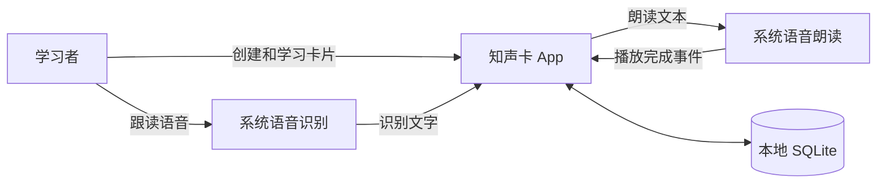

# 知声卡技术架构

状态：草稿

状态管理、清洁架构及 macOS 目标模块边界见[状态管理与分层架构](state-management.md)。

## 1. 架构目标

知声卡第一版仅运行在 Android，并支持：

- 卡片浏览和编辑
- 卡组搜索与“首页 / 我的”底部导航
- 左右双向循环浏览、正反面快速记忆点
- 手动学习、自动跟读和自动播放
- 系统语音朗读
- 用户跟读识别
- 跟读完成或自动播放后翻面并切到下一张
- 本地数据保存
- 语音功能不可用时继续手动学习

第一版采用本地优先设计，不依赖业务后端。

卡组、卡片、设置与每个卡组的当前位置保存在本机。第一版没有“已掌握”判定、今日复习计划或学习结果页。

## 2. 技术栈

| 范围 | 技术 |
|---|---|
| 平台 | Android |
| 开发语言 | Kotlin |
| UI | Jetpack Compose + Material 3 |
| 导航 | Navigation Compose |
| 状态管理 | ViewModel + StateFlow |
| 异步 | Kotlin Coroutines |
| 本地数据库 | Room（SQLite） |
| 手势与动画 | Compose Foundation / Animation |
| 语音能力 | Android TextToSpeech / SpeechRecognizer |

工程骨架已创建，已接入依赖的版本锁定在 `android/gradle/libs.versions.toml`，Gradle 版本由 Wrapper 锁定。Navigation Compose、Room 等业务依赖尚待引入；下文描述目标架构，不代表已经实现。

## 3. 系统上下文

