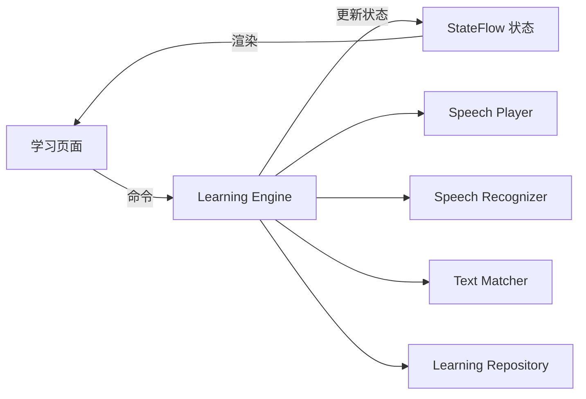
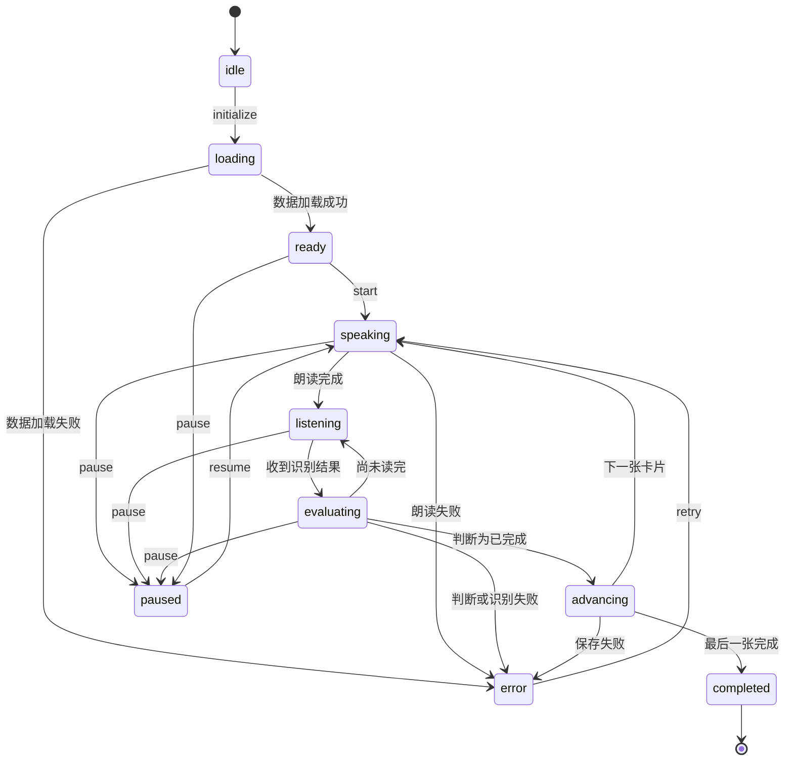
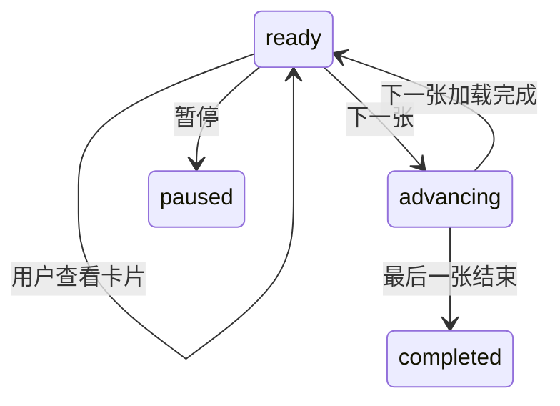

# Learning Engine 设计

状态：草稿

## 1. 目标

Learning Engine 负责控制整个学习过程：


- 加载学习会话和当前卡片
- 控制 App 朗读
- 在朗读完成后开启语音识别
- 判断用户是否完成跟读
- 保存学习结果
- 自动切换下一张卡片
- 处理暂停、重读、跳过和手动翻页
- 取消旧语音任务，防止重复翻页

Learning Engine 使用 Kotlin 实现，不依赖 Compose 页面或 Android UI 类型。文中的 Kotlin 片段是待实现的领域契约，流程步骤用于说明规则。命令通过协程执行，状态通过 `StateFlow` 输出；实现时串行处理命令和系统回调。枚举的 `value` 对应下文状态图中的名称。

## 2. 架构位置



页面只能向 Engine 发送命令，不能直接修改学习阶段。


## 3. 学习阶段

```kotlin
enum class LearningPhase(val value: String) {
    IDLE("idle"),
    LOADING("loading"),
    READY("ready"),
    SPEAKING("speaking"),
    LISTENING("listening"),
    EVALUATING("evaluating"),
    ADVANCING("advancing"),
    PAUSED("paused"),
    COMPLETED("completed"),
    ERROR("error"),
    DISPOSED("disposed")
}
```

| 状态 | 含义 |
|---|---|
| `idle` | Engine 尚未初始化 |
| `loading` | 正在读取会话和卡片 |
| `ready` | 当前卡片准备完成 |
| `speaking` | App 正在朗读 |
| `listening` | 正在接收用户跟读 |
| `evaluating` | 正在判断识别结果 |
| `advancing` | 正在保存结果并切换卡片 |
| `paused` | 学习已暂停 |
| `completed` | 本轮学习完成 |
| `error` | 当前操作失败 |
| `disposed` | 页面已退出，Engine 不再工作 |

## 4. 主状态流转

### 自动跟读模式



### 手动模式



手动模式中的朗读是一个受控操作，但朗读结束后不会自动开启识别。

## 5. Engine 对外命令

```kotlin
interface LearningEngine {
    val state: kotlinx.coroutines.flow.StateFlow<LearningEngineState>

    suspend fun initialize(sessionId: String): Unit
    suspend fun start(): Unit
    suspend fun pause(): Unit
    suspend fun resume(): Unit
    suspend fun next(): Unit
    suspend fun previous(): Unit
    suspend fun skip(): Unit
    suspend fun retry(): Unit
    suspend fun replay(): Unit
    suspend fun stopSpeaking(): Unit
    suspend fun setMode(mode: LearningMode): Unit
    suspend fun dispose(): Unit
}
```

### 命令规则

| 命令 | 行为 |
|---|---|
| `initialize` | 加载会话和当前卡片 |
| `start` | 开始当前卡片学习 |
| `pause` | 停止朗读和识别，进入暂停 |
| `resume` | 从当前卡片开头重新开始 |
| `next` | 手动完成当前卡片并进入下一张 |
| `previous` | 返回上一张，不创建完成记录 |
| `skip` | 记录跳过并进入下一张 |
| `retry` | 错误后重新开始当前卡片 |
| `replay` | 清除本轮临时识别进度并重新朗读 |
| `stopSpeaking` | 手动模式下停止朗读 |
| `setMode` | 切换学习模式并重新开始当前卡片 |
| `dispose` | 停止全部任务并释放资源 |

## 6. Engine 输出状态

```kotlin
data class LearningEngineState(
    val sessionId: String?,
    val deckId: String?,
    val mode: LearningMode,
    val phase: LearningPhase,
    val cards: List<Card>,
    val currentIndex: Int,
    val currentCard: Card?,
    val operationId: String?,
    val transcript: String,
    val matchProgress: MatchProgress?,
    val matchResult: MatchResult?,
    val previousPhase: LearningPhase?,
    val error: LearningError?
)
```

计算属性：

```kotlin
data class LearningProgress(
    val current: Int,
    val total: Int,
    val canGoPrevious: Boolean,
    val canGoNext: Boolean,
    val isLastCard: Boolean
)
```

页面根据 Engine 状态渲染，不自行推断流程阶段。

## 7. Engine 接收的内部事件

```kotlin
sealed interface LearningEvent {
    data class SpeechStarted(val operationId: String) : LearningEvent
    data class SpeechCompleted(val operationId: String) : LearningEvent
    data class SpeechFailed(val operationId: String, val error: SpeechError) : LearningEvent
    data class RecognitionPartial(val operationId: String, val transcript: String) : LearningEvent
    data class RecognitionFinal(val operationId: String, val transcript: String) : LearningEvent
    data class RecognitionSilence(val operationId: String) : LearningEvent
    data class RecognitionFailed(val operationId: String, val error: SpeechError) : LearningEvent
    data object AppBackgrounded : LearningEvent
    data object AudioInterrupted : LearningEvent
}
```

## 8. operationId 取消机制

每次开始、重读或切换卡片时，都创建新的 `operationId`：

```kotlin
val operationId = java.util.UUID.randomUUID().toString()
```

调用语音服务时传入它：

```kotlin
speechPlayer.speak(SpeakRequest(
    operationId = operationId,
    text = targetText,
    language = card.language,
    rate = settings.speechRate,
))
```

处理回调前必须验证：

```kotlin
fun isCurrentOperation(operationId: String): Boolean =
    state.operationId == operationId && state.phase != LearningPhase.DISPOSED
```

如果不属于当前操作，直接忽略：

```kotlin
if (!isCurrentOperation(event.operationId)) return
```

以下行为都要使旧操作失效：

- 暂停
- 重读
- 上一张
- 下一张
- 跳过
- 切换模式
- App 进入后台
- 离开学习页面

使旧操作失效的顺序：

```text
1. 生成新 operationId，或者将其设为 null
2. 更新 Engine 状态
3. 停止朗读
4. 取消语音识别
```

先让 ID 失效，可以避免停止语音过程中收到旧回调。

## 9. 自动学习流程

### 开始当前卡片

```text
没有当前卡片 → 结束会话
生成新的 operationId
更新 StateFlow：phase = speaking，清空 transcript、匹配进度和错误
调用 SpeechPlayer.speak，传入 operationId、跟读文本、语言和设置中的语速
```

### 朗读完成

```text
忽略不属于当前 operationId 的回调
手动模式 → phase = ready，不开启识别
自动模式 → phase = listening
调用 SpeechRecognizer.start，传入当前 operationId、卡片语言、部分结果和端侧识别偏好
```

### 收到识别结果

```text
忽略不属于当前 operationId 或不允许匹配阶段的回调
更新 phase = evaluating 和临时 transcript
构造 MatchInput：targetText、transcript、previousProgress、signal
调用 SpeechMatcher.match，得到 MatchProgress 并保留在内存
将 coverage、endingMatched、algorithmVersion 投影为 MatchResult
completed = true → 进入单卡完成流程
否则恢复 phase = listening
```

### 完成并翻页

```text
验证 operationId、当前阶段和完成锁（详见第 13 节）
设置完成锁，更新 phase = advancing
取消当前识别
在 Repository 事务中保存单卡结果并推进会话位置：
    sessionId、cardId、cardRevision、outcome = read_completed、MatchResult
再次验证 operationId
使用协程 delay 等待 autoAdvanceDelayMs
再次验证 operationId，然后切换到下一张卡片
成功或失败后均清理完成锁
```

Repository 必须在一个事务中保存单卡结果和会话进度。

## 10. 跟读识别会话中断

部分设备可能在用户停顿后自动结束识别。

如果尚未完成匹配：

```text
识别结束
  ↓
检查当前覆盖率
  ├─ 已满足完成条件 → 完成并翻页
  └─ 未满足完成条件 → 重新开启识别
```

需要限制自动重启次数，初始建议：

```kotlin
private const val MAX_RECOGNITION_RESTARTS = 3
```

超过限制后：

- 状态进入 `error`
- 保留当前卡片
- 显示“重新跟读”和“切换手动模式”
- 不自动翻页

重新开启识别时，已经确认的跟读进度应保留。

## 11. 暂停和恢复

暂停时：

1. 立即使当前 `operationId` 失效。
2. 停止朗读。
3. 取消识别。
4. 清除临时识别文字和匹配进度。
5. 设置状态为 `paused`。

恢复时：

1. 保持当前卡片不变。
2. 创建新的 `operationId`。
3. 从当前卡片开头重新朗读。
4. 不恢复暂停前的半句跟读。

App 进入后台或音频被系统中断时，执行与暂停相同的逻辑。

返回前台后，必须由用户点击继续，不能自动打开麦克风。

## 12. 手动翻页

用户滑动到下一张：

1. 使旧 `operationId` 失效。
2. 停止播放和识别。
3. 手动模式下保存 `viewed` 记录。
4. 自动模式下不把未完成卡片保存为 `read_completed`。
5. 更新会话位置。
6. 显示下一张卡片。
7. 自动模式下开始朗读下一张。

自动模式中，普通滑动下一张按 `skip` 处理，记录为 `skipped`。

用户返回上一张时：

- 不删除已经产生的历史记录
- 不创建新的完成记录
- 将会话位置更新为上一张
- 自动模式下重新开始上一张的完整流程

## 13. 防止重复翻页

Engine 内部增加完成锁：

```kotlin
private var advancingOperationId: String? = null
```

进入完成流程前检查：

```kotlin
if (advancingOperationId == operationId) return
advancingOperationId = operationId
```

翻页结束或失败后清理：

```kotlin
advancingOperationId = null
```

同时使用三个保护条件：

- `operationId` 必须仍然有效
- 当前阶段必须允许完成
- 相同操作只能进入一次 `advancing`

## 14. 错误模型

```kotlin
enum class LearningErrorCode(val value: String) {
    SESSION_NOT_FOUND("SESSION_NOT_FOUND"),
    CARD_NOT_FOUND("CARD_NOT_FOUND"),
    DATABASE_ERROR("DATABASE_ERROR"),
    MICROPHONE_PERMISSION_DENIED("MICROPHONE_PERMISSION_DENIED"),
    SPEECH_UNAVAILABLE("SPEECH_UNAVAILABLE"),
    SPEECH_PLAYBACK_FAILED("SPEECH_PLAYBACK_FAILED"),
    RECOGNITION_FAILED("RECOGNITION_FAILED"),
    RECOGNITION_TIMEOUT("RECOGNITION_TIMEOUT"),
    AUDIO_INTERRUPTED("AUDIO_INTERRUPTED"),
    UNKNOWN("UNKNOWN")
}

data class LearningError(
    val code: LearningErrorCode,
    val message: String,
    val recoverable: Boolean,
    val operationId: String?
)
```

错误信息分两部分：

- `code`：程序判断如何恢复
- `message`：页面展示给用户

底层错误信息记录到开发日志，不直接展示给普通用户。

## 15. 页面退出与资源释放

离开学习页面时必须调用：

```kotlin
engine.dispose()
```

`dispose()` 需要：

1. 使当前操作失效。
2. 停止语音播放。
3. 取消语音识别。
4. 取消自动翻页计时器。
5. 取消 App 状态监听。
6. 取消音频中断监听。
7. 将阶段设置为 `disposed`。

`disposed` 状态不能再接收命令或更新 `StateFlow`。

## 16. 第一版验收重点

- 朗读结束后才开启麦克风。
- 用户只读开头时不会翻页。
- 完成一次跟读只翻一张卡片。
- 连续收到相同完成回调时不会重复翻页。
- 手动翻页后，上一张的回调不会影响当前卡片。
- 暂停后不继续朗读或监听。
- 返回前台后不会自动打开麦克风。
- 保存学习结果失败时不会翻页。
- 最后一张完成后会话正确结束。
