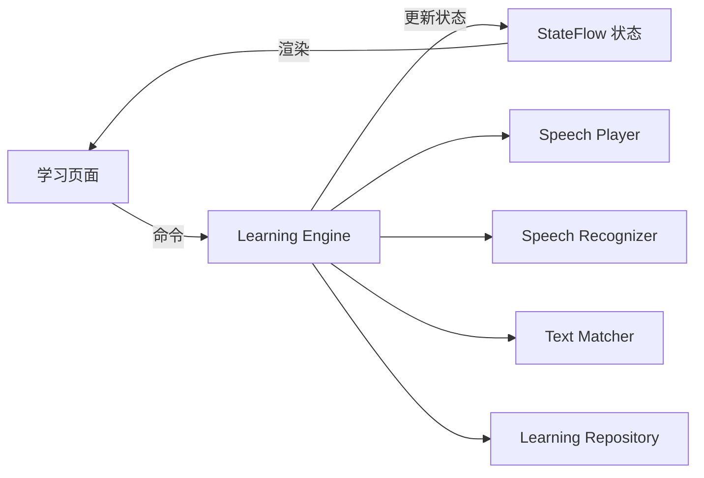
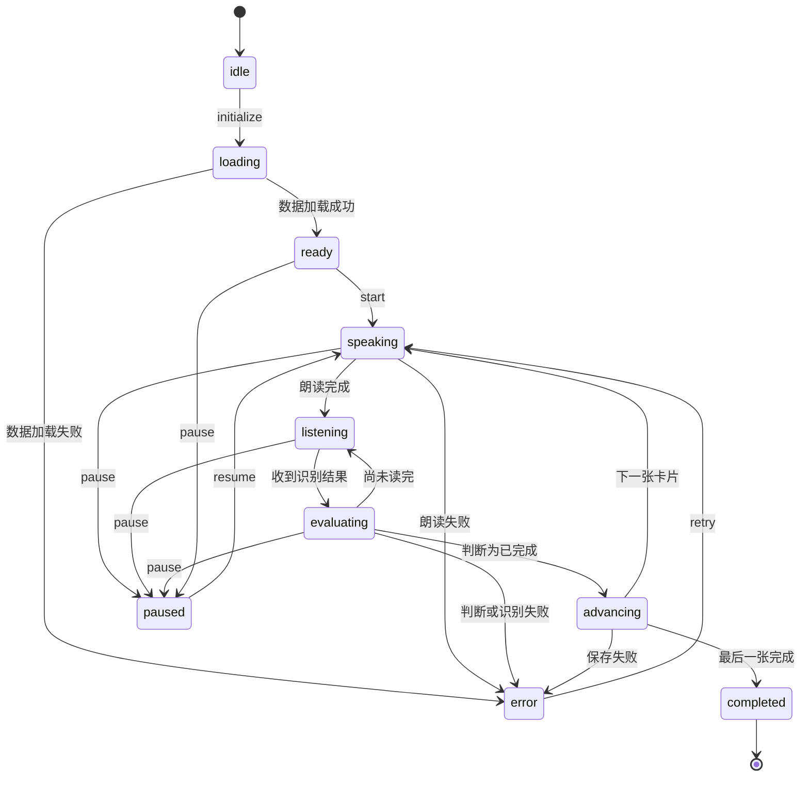
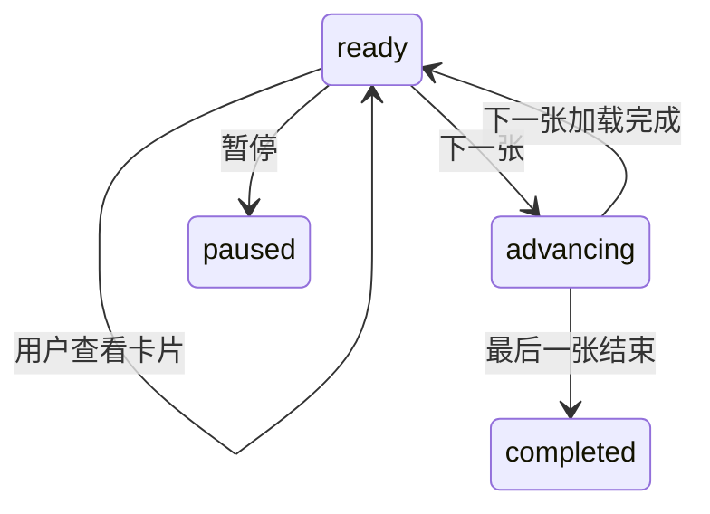

# Learning Engine 设计

状态：草稿

## 1. 目标

Learning Engine 负责控制整个学习过程：


- 加载学习会话和当前卡片
- 控制 App 朗读
- 在朗读完成后开启语音识别
- 判断用户是否完成跟读
- 保存学习结果
- 自动切换下一张卡片
- 处理暂停、重读、跳过和手动翻页
- 取消旧语音任务，防止重复翻页

Learning Engine 使用 Kotlin 实现，不依赖 Compose 页面或 Android UI 类型。文中的类型片段是领域设计伪代码，实现时使用 Kotlin 的 `sealed interface`、`data class`、协程和 `StateFlow` 表达同等约束。

## 2. 架构位置



页面只能向 Engine 发送命令，不能直接修改学习阶段。


## 3. 学习阶段

```ts
export type LearningPhase =
  | 'idle'
  | 'loading'
  | 'ready'
  | 'speaking'
  | 'listening'
  | 'evaluating'
  | 'advancing'
  | 'paused'
  | 'completed'
  | 'error'
  | 'disposed';
```

| 状态 | 含义 |
|---|---|
| `idle` | Engine 尚未初始化 |
| `loading` | 正在读取会话和卡片 |
| `ready` | 当前卡片准备完成 |
| `speaking` | App 正在朗读 |
| `listening` | 正在接收用户跟读 |
| `evaluating` | 正在判断识别结果 |
| `advancing` | 正在保存结果并切换卡片 |
| `paused` | 学习已暂停 |
| `completed` | 本轮学习完成 |
| `error` | 当前操作失败 |
| `disposed` | 页面已退出，Engine 不再工作 |

## 4. 主状态流转

### 自动跟读模式



### 手动模式



手动模式中的朗读是一个受控操作，但朗读结束后不会自动开启识别。

## 5. Engine 对外命令

```ts
export interface LearningEngine {
  initialize(sessionId: string): Promise<void>;
  start(): Promise<void>;

  pause(): Promise<void>;
  resume(): Promise<void>;

  next(): Promise<void>;
  previous(): Promise<void>;
  skip(): Promise<void>;
  retry(): Promise<void>;

  replay(): Promise<void>;
  stopSpeaking(): Promise<void>;

  setMode(mode: LearningMode): Promise<void>;
  dispose(): Promise<void>;
}
```

### 命令规则

| 命令 | 行为 |
|---|---|
| `initialize` | 加载会话和当前卡片 |
| `start` | 开始当前卡片学习 |
| `pause` | 停止朗读和识别，进入暂停 |
| `resume` | 从当前卡片开头重新开始 |
| `next` | 手动完成当前卡片并进入下一张 |
| `previous` | 返回上一张，不创建完成记录 |
| `skip` | 记录跳过并进入下一张 |
| `retry` | 错误后重新开始当前卡片 |
| `replay` | 清除本轮临时识别进度并重新朗读 |
| `stopSpeaking` | 手动模式下停止朗读 |
| `setMode` | 切换学习模式并重新开始当前卡片 |
| `dispose` | 停止全部任务并释放资源 |

## 6. Engine 输出状态

```ts
export interface LearningEngineState {
  sessionId: string | null;
  deckId: string | null;

  mode: LearningMode;
  phase: LearningPhase;

  cards: Card[];
  currentIndex: number;
  currentCard: Card | null;

  operationId: string | null;

  transcript: string;
  matchResult: MatchResult | null;

  previousPhase: LearningPhase | null;

  error: LearningError | null;
}
```

计算属性：

```ts
export interface LearningProgress {
  current: number;
  total: number;
  canGoPrevious: boolean;
  canGoNext: boolean;
  isLastCard: boolean;
}
```

页面根据 Engine 状态渲染，不自行推断流程阶段。

## 7. Engine 接收的内部事件

```ts
export type LearningEvent =
  | {
      type: 'SPEECH_STARTED';
      operationId: string;
    }
  | {
      type: 'SPEECH_COMPLETED';
      operationId: string;
    }
  | {
      type: 'SPEECH_FAILED';
      operationId: string;
      error: SpeechError;
    }
  | {
      type: 'RECOGNITION_PARTIAL';
      operationId: string;
      transcript: string;
    }
  | {
      type: 'RECOGNITION_FINAL';
      operationId: string;
      transcript: string;
    }
  | {
      type: 'RECOGNITION_SILENCE';
      operationId: string;
    }
  | {
      type: 'RECOGNITION_FAILED';
      operationId: string;
      error: SpeechError;
    }
  | {
      type: 'APP_BACKGROUNDED';
    }
  | {
      type: 'AUDIO_INTERRUPTED';
    };
```

## 8. operationId 取消机制

每次开始、重读或切换卡片时，都创建新的 `operationId`：

```ts
const operationId = crypto.randomUUID();
```

调用语音服务时传入它：

```ts
await speechPlayer.speak({
  operationId,
  text: targetText,
  language: card.language,
});
```

处理回调前必须验证：

```ts
function isCurrentOperation(operationId: string): boolean {
  return (
    state.operationId === operationId &&
    state.phase !== 'disposed'
  );
}
```

如果不属于当前操作，直接忽略：

```ts
if (!isCurrentOperation(event.operationId)) {
  return;
}
```

以下行为都要使旧操作失效：

- 暂停
- 重读
- 上一张
- 下一张
- 跳过
- 切换模式
- App 进入后台
- 离开学习页面

使旧操作失效的顺序：

```text
1. 生成新 operationId，或者将其设为 null
2. 更新 Engine 状态
3. 停止朗读
4. 取消语音识别
```

先让 ID 失效，可以避免停止语音过程中收到旧回调。

## 9. 自动学习流程

### 开始当前卡片

```ts
async function startCurrentCard(): Promise<void> {
  const card = state.currentCard;

  if (!card) {
    return completeSession();
  }

  const operationId = createOperationId();

  setState({
    phase: 'speaking',
    operationId,
    transcript: '',
    matchResult: null,
    error: null,
  });

  await speechPlayer.speak({
    operationId,
    text: getTargetText(card),
    language: card.language,
    rate: settings.speechRate,
  });
}
```

### 朗读完成

```ts
async function onSpeechCompleted(
  operationId: string,
): Promise<void> {
  if (!isCurrentOperation(operationId)) {
    return;
  }

  if (state.mode === 'manual') {
    setState({ phase: 'ready' });
    return;
  }

  setState({ phase: 'listening' });

  await speechRecognizer.start({
    operationId,
    language: state.currentCard!.language,
  });
}
```

### 收到识别结果

```ts
async function onTranscript(
  operationId: string,
  transcript: string,
): Promise<void> {
  if (!isCurrentOperation(operationId)) {
    return;
  }

  setState({
    phase: 'evaluating',
    transcript,
  });

  const result = matcher.match({
    target: getTargetText(state.currentCard!),
    transcript,
  });

  setState({ matchResult: result });

  if (result.completed) {
    await completeCurrentCard(operationId, result);
    return;
  }

  setState({ phase: 'listening' });
}
```

### 完成并翻页

```ts
async function completeCurrentCard(
  operationId: string,
  result: MatchResult,
): Promise<void> {
  if (!isCurrentOperation(operationId)) {
    return;
  }

  setState({ phase: 'advancing' });

  await speechRecognizer.cancel(operationId);

  await repository.completeCard({
    sessionId: state.sessionId!,
    cardId: state.currentCard!.id,
    cardRevision: state.currentCard!.revision,
    outcome: 'read_completed',
    matchResult: result,
  });

  if (!isCurrentOperation(operationId)) {
    return;
  }

  await wait(settings.autoAdvanceDelayMs);

  if (!isCurrentOperation(operationId)) {
    return;
  }

  await moveToNextCard();
}
```

Repository 必须在一个事务中保存单卡结果和会话进度。

## 10. 跟读识别会话中断

部分设备可能在用户停顿后自动结束识别。

如果尚未完成匹配：

```text
识别结束
  ↓
检查当前覆盖率
  ├─ 已满足完成条件 → 完成并翻页
  └─ 未满足完成条件 → 重新开启识别
```

需要限制自动重启次数，初始建议：

```ts
const MAX_RECOGNITION_RESTARTS = 3;
```

超过限制后：

- 状态进入 `error`
- 保留当前卡片
- 显示“重新跟读”和“切换手动模式”
- 不自动翻页

重新开启识别时，已经确认的跟读进度应保留。

## 11. 暂停和恢复

暂停时：

1. 立即使当前 `operationId` 失效。
2. 停止朗读。
3. 取消识别。
4. 清除临时识别文字和匹配进度。
5. 设置状态为 `paused`。

恢复时：

1. 保持当前卡片不变。
2. 创建新的 `operationId`。
3. 从当前卡片开头重新朗读。
4. 不恢复暂停前的半句跟读。

App 进入后台或音频被系统中断时，执行与暂停相同的逻辑。

返回前台后，必须由用户点击继续，不能自动打开麦克风。

## 12. 手动翻页

用户滑动到下一张：

1. 使旧 `operationId` 失效。
2. 停止播放和识别。
3. 手动模式下保存 `viewed` 记录。
4. 自动模式下不把未完成卡片保存为 `read_completed`。
5. 更新会话位置。
6. 显示下一张卡片。
7. 自动模式下开始朗读下一张。

自动模式中，普通滑动下一张按 `skip` 处理，记录为 `skipped`。

用户返回上一张时：

- 不删除已经产生的历史记录
- 不创建新的完成记录
- 将会话位置更新为上一张
- 自动模式下重新开始上一张的完整流程

## 13. 防止重复翻页

Engine 内部增加完成锁：

```ts
private advancingOperationId: string | null = null;
```

进入完成流程前检查：

```ts
if (advancingOperationId === operationId) {
  return;
}

advancingOperationId = operationId;
```

翻页结束或失败后清理：

```ts
advancingOperationId = null;
```

同时使用三个保护条件：

- `operationId` 必须仍然有效
- 当前阶段必须允许完成
- 相同操作只能进入一次 `advancing`

## 14. 错误模型

```ts
export type LearningErrorCode =
  | 'SESSION_NOT_FOUND'
  | 'CARD_NOT_FOUND'
  | 'DATABASE_ERROR'
  | 'MICROPHONE_PERMISSION_DENIED'
  | 'SPEECH_UNAVAILABLE'
  | 'SPEECH_PLAYBACK_FAILED'
  | 'RECOGNITION_FAILED'
  | 'RECOGNITION_TIMEOUT'
  | 'AUDIO_INTERRUPTED'
  | 'UNKNOWN';

export interface LearningError {
  code: LearningErrorCode;
  message: string;
  recoverable: boolean;
  operationId: string | null;
}
```

错误信息分两部分：

- `code`：程序判断如何恢复
- `message`：页面展示给用户

底层错误信息记录到开发日志，不直接展示给普通用户。

## 15. 页面卸载

离开学习页面时必须调用：

```ts
await engine.dispose();
```

`dispose()` 需要：

1. 使当前操作失效。
2. 停止语音播放。
3. 取消语音识别。
4. 取消自动翻页计时器。
5. 取消 App 状态监听。
6. 取消音频中断监听。
7. 将阶段设置为 `disposed`。

`disposed` 状态不能再接收命令或更新 `StateFlow`。

## 16. 第一版验收重点

- 朗读结束后才开启麦克风。
- 用户只读开头时不会翻页。
- 完成一次跟读只翻一张卡片。
- 连续收到相同完成回调时不会重复翻页。
- 手动翻页后，上一张的回调不会影响当前卡片。
- 暂停后不继续朗读或监听。
- 返回前台后不会自动打开麦克风。
- 保存学习结果失败时不会翻页。
- 最后一张完成后会话正确结束。
