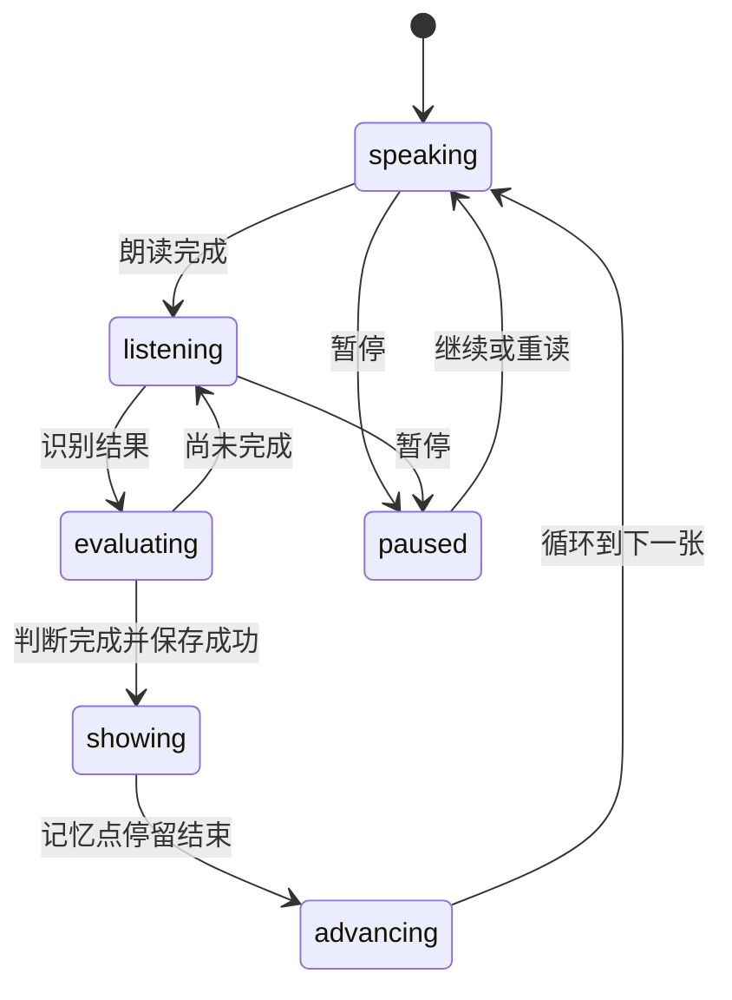
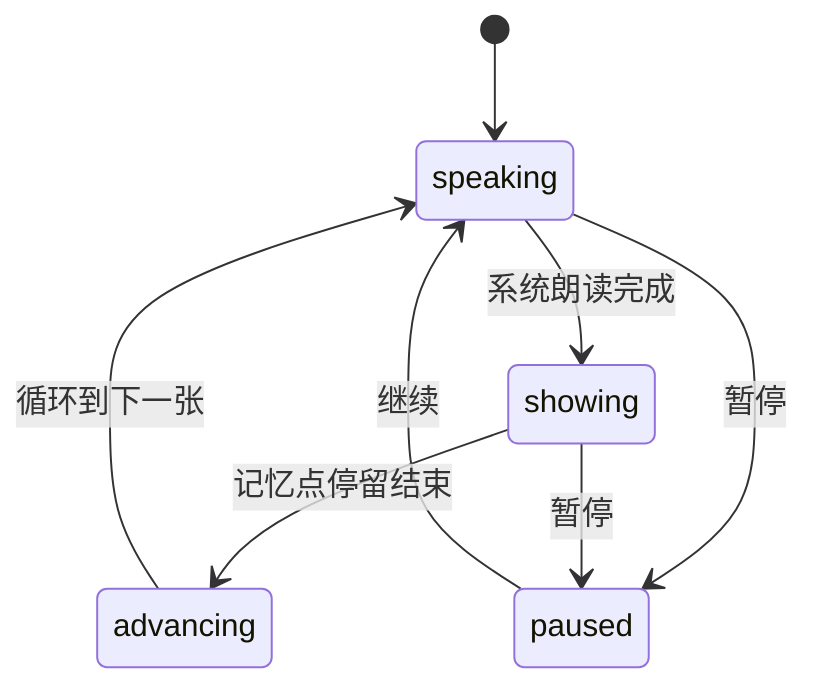

# Learning Engine 设计

状态：已确认

## 1. 职责

Learning Engine 控制三种学习模式、左右循环切卡、正反面、语音任务、跟读匹配、自动翻面、位置保存和学习记录。它使用 Kotlin、协程与 `StateFlow`，不依赖 Compose 或 Room 类型。

## 2. 状态模型

```kotlin
enum class LearningPhase {
    IDLE, LOADING, READY, SPEAKING, LISTENING, EVALUATING,
    SHOWING_MEMORY_TIP, ADVANCING, PAUSED, ERROR, DISPOSED,
}

enum class CardFace { FRONT, BACK }

data class LearningError(
    val code: String,
    val message: String,
    val recoverable: Boolean,
)

data class LearningEngineState(
    val deckId: String,
    val mode: LearningMode,
    val phase: LearningPhase,
    val cards: List<Card>,
    val currentIndex: Int,
    val cardFace: CardFace,
    val operationId: String?,
    val speechSegmentIndex: Int,
    val matchProgress: MatchProgress?,
    val error: LearningError?,
)
```

界面只读取状态并发送命令。完整识别文本只保存在 Engine 内存中，不进入 UI 状态或日志。

## 3. 命令

```kotlin
interface LearningEngine {
    val state: kotlinx.coroutines.flow.StateFlow<LearningEngineState>

    suspend fun initialize(deckId: String, mode: LearningMode)
    suspend fun start()
    suspend fun pause()
    suspend fun resume()
    suspend fun replay()
    suspend fun next()
    suspend fun previous()
    suspend fun flip()
    suspend fun setMode(mode: LearningMode)
    suspend fun setSpeechRate(rate: Double)
    suspend fun dispose()
}
```

## 4. 循环切卡

```kotlin
fun nextIndex(current: Int, size: Int) = (current + 1) % size
fun previousIndex(current: Int, size: Int) = (current - 1 + size) % size
```

左滑调用 `next()`，右滑调用 `previous()`。两者都先使旧 `operationId` 失效，再停止朗读和识别、更新本地位置、显示目标卡片正面，并按当前自动模式启动流程。

- 手动模式下一张记录 `viewed`，上一张不创建记录。
- 自动跟读中主动切卡停止当前朗读和识别，不产生跟读完成记录。
- 自动播放切卡只更新位置。
- 卡组为空时不创建 Engine，入口保持禁用。

## 5. operationId

每次朗读、重读、切卡、切换模式或恢复都创建新的 `operationId`。系统回调只有在 ID 与当前状态一致时才生效。

以下行为先使 ID 失效，再取消资源：暂停、重读、左右切卡、模式切换、进入后台和退出页面。相同跟读操作使用完成锁，保证最多推进一次。

## 6. 手动学习

手动模式初始化为 `READY`。播放时按句子或短语拆分目标文本，逐段交给 TTS：

- 播放：从第 0 段开始。
- 暂停：停止 TTS，保存当前分段索引并进入 `PAUSED`。
- 继续：从保存的分段开头继续。
- 播放完成：清除分段位置并回到 `READY`。
- 切卡、切换模式或退出：清除分段位置。

Android `TextToSpeech` 不保证原句中间精确暂停，因此分段边界是第一版的恢复精度。

## 7. 自动跟读



完成顺序：

1. 验证 `operationId` 和完成锁。
2. 取消识别并进入 `EVALUATING`。
3. 在事务中保存 `read_completed` 和下一张位置。
4. 当前卡片切到背面并进入 `SHOWING_MEMORY_TIP`。
5. 等待 `autoAdvanceDelayMs`。
6. 左向切换下一张，创建新操作并朗读。

用户主动切卡时取消当前跟读并清除临时匹配进度，不保存跟读完成记录。暂停、重读或模式切换也清除临时匹配进度。

## 8. 自动播放



自动播放必须等待真实 TTS 完成事件，不能用固定朗读时长。翻面后无论是否填写快速记忆点都进入 `SHOWING_MEMORY_TIP`。播放速度变化对下一次朗读生效；实现允许在当前卡片重新开始以立即应用。

## 9. 翻面与模式切换

手动点击 `flip()` 在正反面切换。自动模式在流程控制期间也允许用户查看背面，但恢复、重读和切换模式都回到正面。

`setMode()` 的顺序：使旧操作失效、停止 TTS、取消识别、清除临时进度、切回正面、保存 `lastMode`，然后从当前卡片按新模式开始。

## 10. 后台与退出

进入后台或发生音频中断时执行 `pause()`，停止朗读和识别并保存当前位置。返回前台保持暂停，不自动继续。

用户关闭学习页面时直接保存当前位置并调用 `dispose()`：

1. 使当前操作失效。
2. 停止 TTS 和识别。
3. 取消翻面、延迟和事件收集任务。
4. 清除内存中的识别文字。
5. 进入 `DISPOSED`。

冷启动只进入首页；下次选择模式后从该卡组保存的位置开始。

## 11. 错误恢复

- 朗读失败：保留卡片，提供重试或切换模式。
- 权限拒绝：提供重试、系统设置和手动学习。
- 识别不可用：提供重试或手动学习。
- 保存失败：不切卡，保留当前状态并重试。
- 识别多次无结果：停止自动重启，提供重读或手动学习。

## 12. 验收重点

- 三种模式左右切卡都能首尾双向循环。
- 朗读完成后才开启麦克风。
- 自动跟读和自动播放都先翻到快速记忆点再前进。
- 完成回调重复到达时只前进一次。
- 翻页和切换模式后旧回调无效。
- 手动朗读能按分段暂停和继续。
- 后台与冷启动不会自动打开麦克风。
- 数据保存失败时不会切换卡片。
