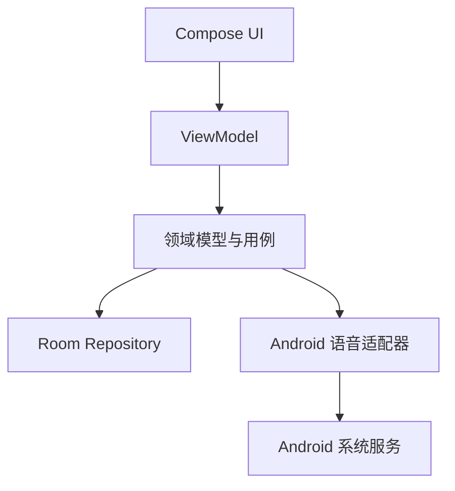

# ADR-001：仅开发 Android 原生 App

状态：已确认  
日期：2026-09-17  
决策人：项目团队

## 1. 背景

知声卡第一版只面向 Android，不再承担 iOS 支持和跨平台代码复用目标。核心能力包括卡片管理、SQLite 本地存储、系统文字转语音、实时语音识别、自动跟读和手势翻页。

## 2. 决策

客户端采用 Android 原生方案：

- Kotlin
- Jetpack Compose + Material 3
- 单 Activity 架构
- Navigation Compose
- ViewModel + StateFlow
- Kotlin Coroutines
- Room
- Android `TextToSpeech`
- Android `SpeechRecognizer`
- Gradle Version Catalog

不使用 React Native、Expo、Flutter，也不创建 iOS 工程。

## 3. 选择 Android 原生的原因

- 第一版只有 Android 目标，跨平台框架不再带来实际收益。
- 可直接控制 `TextToSpeech`、`SpeechRecognizer`、权限、生命周期和 Audio Focus。
- Kotlin 协程和 `StateFlow` 适合实现 Learning Engine 的串行状态流转与取消。
- Compose 能满足卡片手势、动画、状态驱动界面和无障碍需求。
- Room 提供 SQLite schema、迁移和 DAO 的编译期检查。
- 工具链更少，语音问题可以直接在 Android 层定位。

## 4. 不采用的方案

### React Native / Expo

不采用。当前只做 Android，JS 运行时、原生桥接和 Expo 构建层会增加语音生命周期与问题定位成本。

### Flutter

不采用。仍需通过插件或平台通道接入 Android 语音服务，而第一版没有跨平台收益。

### 传统 XML View

暂不采用。Compose 更适合状态驱动页面和卡片动画；仅在遇到 Compose 无法满足的系统组件兼容问题时局部使用 View interop。

## 5. 架构边界



必须遵循：

- Composable 不直接调用 `TextToSpeech`、`SpeechRecognizer` 或 Room DAO。
- Learning Engine 只依赖项目定义的语音接口和 Repository 接口。
- Android 系统回调先转换为统一领域事件，再进入 Engine。
- 所有语音回调都携带 `operationId`，旧任务回调不得影响当前卡片。
- 数据库实体、DAO 和 Android 类型不进入纯领域逻辑。

## 6. 工程策略

采用单 Android 应用模块，业务复杂度增长后再按 feature 拆分 Gradle 模块：

```text
app/src/main/java/.../
├── ui/                  # Compose 页面、组件、导航和 ViewModel
├── domain/              # 模型、Learning Engine、跟读匹配、接口
├── data/                # Room、DAO、Repository 实现
├── speech/              # TTS、识别、权限和 Audio Focus 适配
└── di/                  # 依赖装配

app/src/test/            # JVM 单元测试
app/src/androidTest/     # Android/Compose 集成测试
docs/                    # 项目文档
```

第一版不为未来 iOS 预先增加抽象。接口用于隔离 Android 系统服务并支持测试，不以跨平台为目标。

## 7. 依赖与版本策略

- 使用 Gradle Wrapper 和 Version Catalog 锁定版本。
- Kotlin、Compose Compiler/Plugin 和 Android Gradle Plugin 使用官方兼容组合。
- 优先使用 AndroidX 和 Kotlin 官方库。
- 引入第三方库前确认维护状态、最小 SDK、体积和许可证。
- 语音能力优先直接使用 Android SDK，不依赖第三方语音封装库。

主要依赖分类：

| 用途 | 方案 |
|---|---|
| UI | Jetpack Compose + Material 3 |
| 导航 | Navigation Compose |
| 状态管理 | ViewModel + StateFlow |
| 异步 | Kotlin Coroutines |
| 数据库 | Room |
| 手势与动画 | Compose Foundation / Animation |
| 序列化 | Kotlin Serialization（确有需要时） |
| 单元测试 | JUnit + kotlinx-coroutines-test |
| UI 测试 | Compose UI Test |
| 静态检查 | Android Lint；是否增加 Detekt 后续决定 |

具体版本在工程实现阶段依据当时的稳定兼容组合锁定。

## 8. 语音原型门槛

完整页面开发前，先在目标 Android 真机完成一张固定卡片的语音原型，验证：

- 普通话朗读可用并能收到完成回调。
- 朗读完成后才开始识别。
- 能收到部分或最终识别结果。
- 用户读完后只触发一次翻页。
- 取消识别后，迟到回调不会更新当前卡片。
- App 进入后台后停止使用麦克风。
- 权限拒绝或语音服务缺失时不会崩溃，并能退回手动模式。
- 至少覆盖一台目标品牌真机；不能只用模拟器验收。

## 9. 结果与限制

- 第一版只发布 Android，不提供 iOS 包或 iOS 适配承诺。
- 团队只维护 Kotlin/Android 工具链。
- 不同厂商的语音服务、语言包和离线能力仍可能不同，必须做真机兼容性验证。
- 将来若确认需要 iOS，应创建新的 ADR，重新评估原生双端、Kotlin Multiplatform 或跨平台框架；本决策不预设迁移路径。
