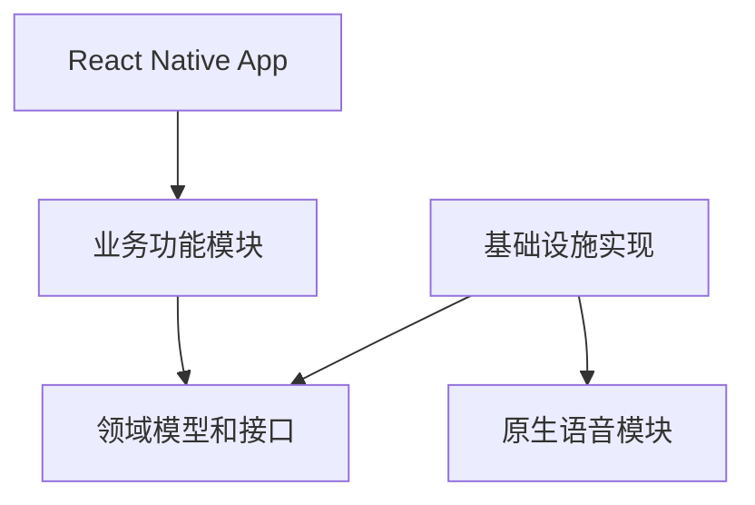

# ADR-001：使用 React Native 开发双平台 App

状态：已确认  
日期：2026-09-15  
决策人：项目团队

## 1. 背景

知声卡需要同时支持 Android 和 iPhone。

主要功能包括：

- 卡组和卡片管理
- 卡片滑动及动画
- 本地 SQLite 存储
- 系统文字转语音
- 实时语音识别
- 自动跟读状态控制
- 麦克风权限和音频中断处理

项目希望复用大部分业务代码，同时保留调用 Android 和 iOS 原生语音能力的能力。

## 2. 决策

客户端采用以下方案：

- React Native
- TypeScript
- Expo Development Build
- Expo Router
- 自定义 Expo 原生语音模块
- SQLite 本地存储
- Zustand 管理学习界面状态
- React Native Gesture Handler 处理手势
- React Native Reanimated 处理卡片动画

Android 原生代码使用 Kotlin，iOS 原生代码使用 Swift。

## 3. 为什么选择 React Native

### 跨平台复用

以下逻辑可以在 Android 和 iPhone 之间共用：

- 页面结构
- 卡片交互
- 学习状态机
- 文本匹配算法
- 数据模型
- SQLite Repository
- 错误处理
- 大部分测试

### TypeScript 适合业务建模

项目已经明确了较多状态和事件：

- 学习阶段
- 朗读事件
- 识别事件
- 匹配结果
- 错误类型
- 数据记录

TypeScript 可以为这些数据提供明确的类型约束。

### 可以访问原生能力

React Native 可以通过原生模块调用：

- Android `TextToSpeech`
- Android `SpeechRecognizer`
- iOS `AVSpeechSynthesizer`
- iOS `SFSpeechRecognizer`
- Android 和 iOS 音频会话能力

当现有第三方库不能满足要求时，可以自行实现原生适配。

## 4. 为什么使用 Expo Development Build

知声卡需要原生语音模块，因此不能只依赖通用的 Expo Go 客户端。

Development Build 支持：

- 加载自定义原生模块
- 调试 Kotlin 和 Swift 代码
- 使用 Expo Router 和 Expo 工具链
- 创建接近正式 App 的开发版本
- 保持 Expo 配置和构建体验

项目早期仍可以使用模拟语音服务开发大部分页面。

## 5. 不采用的方案

### Flutter

优点：

- 跨平台界面一致
- 动画和 UI 工具成熟
- 性能稳定

未选择原因：

- 当前项目决定使用 React Native 技术体系
- TypeScript 更适合当前团队的开发方向
- 业务界面和状态逻辑可以在 RN 中完成

### Android 和 iOS 分别原生开发

优点：

- 直接使用所有平台 API
- 平台行为控制最完整

未选择原因：

- 需要维护 Kotlin 和 Swift 两套完整应用
- 页面、数据和学习流程需要重复实现
- 第一版开发和迭代成本较高

原生代码仍会用于语音能力适配。

### 只使用 Expo Go

未选择原因：

- 无法自由加入所需的自定义原生语音实现
- 难以完整验证语音生命周期和平台音频行为

### 完全依赖第三方 RN 语音库

暂不确定采用。

原因：

- 需要验证库是否仍在维护
- 需要验证新 RN 和 Expo 版本兼容性
- 需要确认是否支持实时结果、取消和错误映射
- 需要确认是否能正确处理迟到回调

可以在原型阶段使用第三方库验证，但业务层必须依赖项目自己的语音接口。

## 6. 结果

采用此方案后：

- 主要业务逻辑由 TypeScript 编写一次。
- Android 和 iPhone 共用主要页面和数据层。
- 项目必须维护少量 Kotlin 和 Swift 语音代码。
- 开发人员需要能够运行 Android Studio 和 Xcode。
- 语音功能必须使用真机测试。
- 依赖原生模块的构建不能只使用 Expo Go。
- Expo SDK 或 React Native 大版本升级时，需要重新验证原生语音模块。

## 7. 依赖边界



必须遵循：

- 业务页面不直接导入原生模块。
- Learning Engine 只依赖语音接口。
- 原生模块返回统一事件，不包含页面逻辑。
- SQLite 具体实现不能进入领域模型。
- 第三方语音库只能封装在基础设施层。

## 8. 工程策略

项目使用一个 React Native 工程，同时生成 Android 和 iOS App。

```text
echo_cards/
├── app/                 # 路由
├── src/                 # TypeScript 业务代码
├── modules/             # 本地 Expo 原生模块
├── android/             # Android 原生工程
├── ios/                 # iOS 原生工程
├── docs/                # 项目文档
└── tests/               # 测试
```

`android/` 和 `ios/` 是否提交到 Git，在创建原型后根据原生修改方式确认。

如果所有原生修改都可以通过本地 Expo Module 和配置插件稳定生成，可以考虑使用持续原生生成模式。

## 9. 包管理和版本策略

第一版统一使用 npm，仓库只保留：

```text
package-lock.json
```

禁止同时提交：

```text
yarn.lock
pnpm-lock.yaml
```

版本规则：

- Node.js 使用项目创建时的活跃 LTS 版本。
- Node.js 版本写入 `.nvmrc`。
- npm 版本写入 `package.json` 的 `packageManager`。
- Expo、React Native 和 React 使用 Expo 推荐的兼容组合。
- Expo 相关依赖通过 `npx expo install` 安装。
- 不手动组合未经验证的 React Native 和 Expo 版本。
- 原生依赖升级后必须重新生成 Development Build。
- 正式开发开始后提交 lockfile，保证团队安装一致。

## 10. 主要依赖分类

| 用途 | 方案 |
|---|---|
| 路由 | Expo Router |
| 状态管理 | Zustand |
| 数据库 | Expo SQLite |
| 手势 | React Native Gesture Handler |
| 动画 | React Native Reanimated |
| ID 生成 | 选择兼容 RN 的 UUID 实现 |
| 数据校验 | Zod |
| 单元测试 | Jest |
| 组件测试 | React Native Testing Library |
| 代码检查 | ESLint |
| 格式化 | Prettier |

具体包名和版本在项目初始化时根据 Expo SDK 兼容性确定。

## 11. 原型验证条件

正式开发完整页面前，先完成语音技术原型。

原型只需要一张固定卡片，并验证：

- Android 可以朗读普通话。
- iPhone 可以朗读普通话。
- 朗读完成后可以开始识别。
- 两端都能返回部分或最终识别结果。
- 用户读完后可以触发一次翻页。
- 取消识别后不会更新当前卡片。
- App 进入后台后停止使用麦克风。
- 权限拒绝后不会导致 App 崩溃。

语音原型通过后，才锁定语音实现方案。

## 12. 重新评估条件

出现以下情况时重新评估本决策：

- 目标设备无法稳定运行 RN 语音模块。
- 原生桥接造成无法接受的识别延迟。
- Expo 升级长期阻塞所需平台能力。
- 项目需要大量只能用原生实现的音频处理。
- Android 和 iOS 的产品交互开始明显分化。

重新评估时创建新的 ADR，不能直接覆盖本文件的历史决定。
