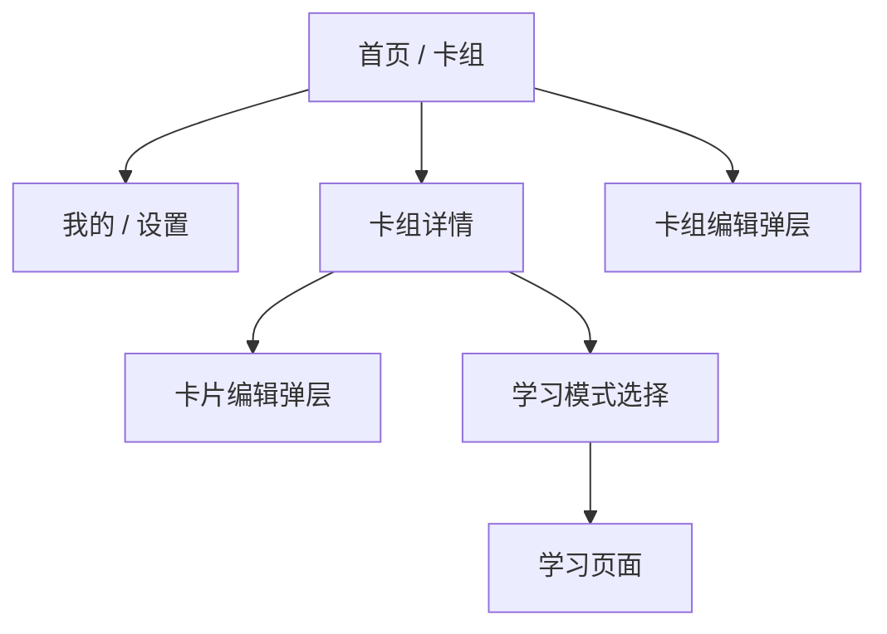

# 页面与交互设计

状态：已确认

## 1. 页面结构



应用使用“首页 / 我的”底部导航。卡组详情和学习页面进入页面栈后不显示底部导航。第一版没有学习结果页。

建议的 Navigation Compose 路由：

```text
Home
Mine
Deck/{deckId}
Learn/{deckId}?mode={mode}
```

卡组编辑、卡片编辑和模式选择使用底部弹层，不建立独立路由。

## 2. 首页

首页包含：

- 标题“卡组”
- 按名称筛选的搜索框
- 卡组列表
- 创建卡组入口
- “首页 / 我的”底部导航

卡组项显示：

```text
初中物理
20 张卡片 · 上次学到第 3 张
```

不显示今日复习、已掌握数量或掌握率。首次安装没有示例数据，显示空状态和“创建第一个卡组”。加载失败时显示原因和重试按钮。

## 3. 我的

设置项：

| 设置项 | 默认值 |
|---|---|
| 默认学习模式 | 手动学习 |
| 朗读速度 | 1.0 |
| 自动翻页延迟 | 600 毫秒 |

默认学习模式可选手动学习、自动跟读和自动播放，在“开始学习”的模式弹层中预选该模式，用户仍可选择其他模式。朗读速度提供试听；自动翻页延迟可选立即、0.6 秒、1 秒或 2 秒。

## 4. 卡组管理

创建和编辑卡组使用底部弹层，字段为名称和可选说明。编辑已有卡组时提供删除入口。

- 名称去除首尾空格后不能为空。
- 保存期间禁止重复提交。
- 删除前二次确认，并说明组内卡片也会删除。

## 5. 卡组详情

卡组详情包含卡组名称、说明、卡片数量、编辑入口、一个“开始学习”按钮和卡片列表。

点击“开始学习”后弹出：

```text
选择学习方式

[手动学习]
[自动跟读]
[自动播放]
```

空卡组将入口改为“添加第一张卡片”，不显示学习模式选择。卡片支持点击编辑、删除和通过排序控件调整顺序。

## 6. 卡片编辑弹层

字段：

| 字段 | 必填 | 说明 |
|---|---|---|
| 标题 | 是 | 知识点名称 |
| 正文 | 是 | 卡片正面的主要内容 |
| 跟读文本 | 否 | 留空时使用正文朗读和匹配 |
| 快速记忆点 | 否 | 卡片背面内容 |

第一版固定普通话，不显示语言选择；不提供标签。标题和正文为空时不能保存。删除卡片需要二次确认。

## 7. 学习页面共同行为

顶部包含关闭按钮、当前模式和当前位置，例如 `3 / 20`。不显示顶部进度条或循环轮次。

卡片正面显示标题和正文，点击翻到快速记忆点；未填写时显示“暂无快速记忆点”。

- 左滑：下一张。
- 右滑：上一张。
- 最后一张左滑回到第一张。
- 第一张右滑回到最后一张。
- 一次手势只移动一张卡片。
- 点击模式名称可切换三种模式；切换时停止当前任务，并从当前卡片正面重新开始。

关闭学习页面时直接停止朗读和麦克风、保存当前位置并回到卡组详情，不显示确认框或结果页。

## 8. 手动学习

手动模式显示朗读控制：播放、暂停和继续。点击卡片独立控制正反面，不触发朗读。

系统 TTS 的暂停通过分段朗读实现。暂停时保存当前分段，继续时从该分段开头恢复；切换卡片或退出后清除分段进度。

## 9. 自动跟读

状态与界面：

| 状态 | 显示 | 控制 |
|---|---|---|
| 朗读 | 正在朗读，请先听一遍 | 暂停、重读、跳过 |
| 监听 | 轮到你读了、覆盖进度百分比 | 暂停、重读、跳过 |
| 确认 | 正在确认跟读进度 | 暂停、重读、跳过 |
| 记忆点 | 自动翻面显示快速记忆点 | 暂停、跳过 |
| 暂停 | 学习已暂停 | 继续、切换模式、退出 |
| 错误 | 对应错误原因 | 重试、系统设置或手动学习 |

界面不显示完整识别文字。覆盖率只表示识别到的文本范围，不表示发音评分或掌握程度。

完成流程：停止识别，保存跟读完成记录，自动翻面，等待设置的延迟，然后左向切换下一张。

## 10. 自动播放

自动播放使用真实系统语音：

```text
朗读正文或跟读文本
        ↓
朗读完成
        ↓
自动翻到快速记忆点
        ↓
等待自动翻页延迟
        ↓
切换下一张并继续循环
```

自动播放提供暂停、继续和播放速度控制。没有快速记忆点时仍翻面并显示占位文字。

## 11. 权限与异常

首次进入自动跟读前显示麦克风用途说明，用户继续后才请求系统权限。权限被拒绝或识别服务不可用时，提供重试、打开系统设置和切换手动学习。

App 进入后台、来电或发生音频中断时停止朗读和收音并进入暂停。返回前台后不自动继续，也不自动打开麦克风。

## 12. 可访问性

- 按钮提供可读标签和至少约 44 × 44 dp 的触控区域。
- 状态同时使用文字表达，不能只依赖颜色。
- 正文支持系统字体缩放。
- 系统开启减少动画时，降低翻面和切换动画。
- 屏幕阅读器开启时，提供明确的“上一张”和“下一张”按钮。

## 13. 第一版验收重点

- 首页搜索、空状态、卡组及卡片管理可用。
- 三种模式都支持左右双向循环。
- 点击卡片能查看快速记忆点。
- 自动跟读在朗读结束后才开启麦克风，并显示覆盖率。
- 自动播放使用真实系统朗读。
- 切换模式、翻页、退出和进入后台会使旧语音回调失效。
- 冷启动回首页，重新进入卡组时从上次卡片继续。
