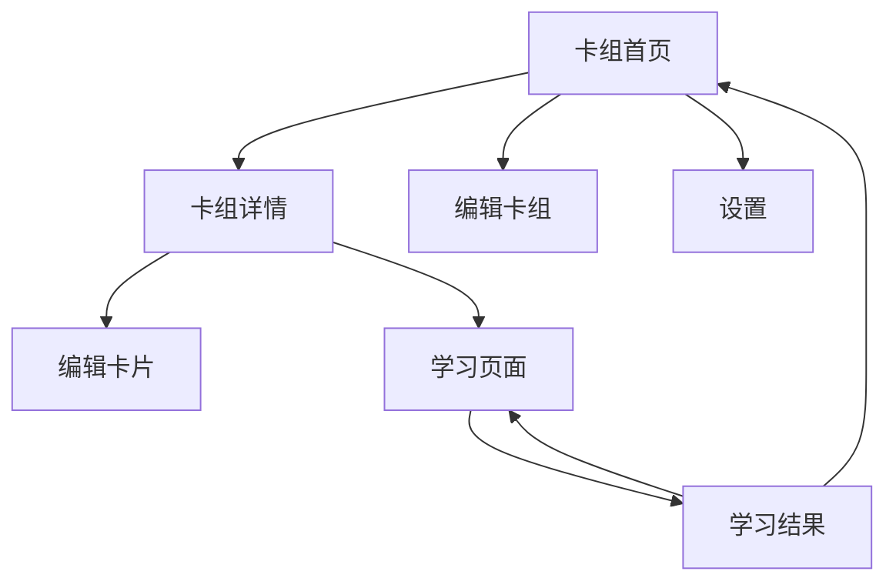

# 页面与交互设计

状态：草稿

## 1. 页面结构

第一版包含以下页面：



对应 Expo Router 路由：

```text
app/
├── _layout.tsx
├── index.tsx
├── settings.tsx
├── decks/
│   ├── new.tsx
│   ├── [deckId].tsx
│   └── [deckId]/
│       └── edit.tsx
├── cards/
│   ├── new.tsx
│   └── [cardId]/
│       └── edit.tsx
└── learn/
    ├── [deckId].tsx
    └── result.tsx
```

## 2. 全局导航

第一版使用简单的页面栈导航，不设置底部 Tab。

主要流程：

```text
卡组首页
  → 卡组详情
    → 学习页面
      → 学习结果
```

内容编辑流程：

```text
卡组首页
  → 创建卡组

卡组详情
  → 新建卡片
  → 编辑卡片
  → 调整卡片顺序
```

## 3. 卡组首页

### 页面目标

让用户查看卡组并开始管理学习内容。

### 页面元素

```text
┌─────────────────────────────┐
│ 知声卡                 设置 │
├─────────────────────────────┤
│ 我的卡组                    │
│                             │
│ ┌─────────────────────────┐ │
│ │ 初中物理                │ │
│ │ 20 张卡片 · 学到第 3 张 │ │
│ └─────────────────────────┘ │
│                             │
│ ┌─────────────────────────┐ │
│ │ 英语短句                │ │
│ │ 12 张卡片 · 尚未开始    │ │
│ └─────────────────────────┘ │
│                             │
│        ＋ 创建卡组          │
└─────────────────────────────┘
```

### 状态

| 状态 | 展示 |
|---|---|
| 加载中 | 页面骨架或加载指示 |
| 有卡组 | 显示卡组列表 |
| 无卡组 | 空状态和“创建第一个卡组” |
| 加载失败 | 错误说明和重试按钮 |

### 交互

- 点击卡组：进入卡组详情。
- 点击创建：进入新建卡组页面。
- 长按或菜单按钮：编辑或删除卡组。
- 点击设置：进入设置页面。

## 4. 卡组编辑页面

字段：

- 卡组名称，必填
- 卡组说明，可选

按钮：

- 保存
- 取消
- 删除，仅编辑已有卡组时显示

校验规则：

- 名称去除首尾空格后不能为空。
- 名称为空时在输入框下方显示错误。
- 删除卡组前说明卡片和未完成会话也会删除。
- 保存期间禁用重复提交。

## 5. 卡组详情页面

### 页面目标

管理卡片并选择学习方式。

```text
┌─────────────────────────────┐
│ ← 初中物理             编辑 │
├─────────────────────────────┤
│ 20 张卡片                   │
│                             │
│ [手动学习]   [自动跟读]     │
│                             │
│ 1  惯性                  ≡  │
│ 2  牛顿第一定律          ≡  │
│ 3  作用力与反作用力      ≡  │
│                             │
│       ＋ 添加知识卡片       │
└─────────────────────────────┘
```

### 交互

- 点击卡片：编辑卡片。
- 拖动排序按钮：调整顺序。
- 点击添加：创建卡片。
- 点击手动学习：创建 `manual` 会话。
- 点击自动跟读：检查语音能力和权限后创建 `repeat` 会话。

### 空状态

卡组没有卡片时：

- 显示“这个卡组还没有知识点”。
- 显示“添加第一张卡片”按钮。
- 禁用两个学习按钮。

## 6. 卡片编辑页面

字段：

| 字段 | 必填 | 说明 |
|---|---|---|
| 标题 | 是 | 知识点名称 |
| 正文 | 是 | 卡片展示内容 |
| 跟读文本 | 否 | 留空时使用正文 |
| 补充解释 | 否 | 不参与跟读 |
| 语言 | 是 | 第一版默认普通话 |

页面示例：

```text
┌─────────────────────────────┐
│ 取消      编辑卡片      保存│
├─────────────────────────────┤
│ 标题                        │
│ [惯性____________________] │
│                             │
│ 正文                        │
│ [物体保持原来运动状态……  ] │
│                             │
│ 跟读文本（可选）            │
│ [留空时使用正文__________] │
│ [试听]                      │
│                             │
│ 补充解释（可选）            │
│ [公交车刹车时……_________] │
└─────────────────────────────┘
```

### 交互规则

- 标题和正文为空时不能保存。
- 点击试听：朗读 `speechText ?? content`。
- 退出时存在未保存修改，需要提示用户。
- 修改正文、跟读文本或语言时，卡片版本加 1。
- 保存成功后返回卡组详情。

## 7. 学习页面

学习页面是第一版的核心。

### 基础布局

```text
┌─────────────────────────────┐
│ ×        3 / 20       暂停  │
│ ━━━━━────────────────────── │
│                             │
│ ┌─────────────────────────┐ │
│ │ 惯性                    │ │
│ │                         │ │
│ │ 物体保持原来运动状态    │ │
│ │ 不变的性质叫作惯性。    │ │
│ │                         │ │
│ │ 查看解释                │ │
│ └─────────────────────────┘ │
│                             │
│       🔊 App 正在朗读       │
│                             │
│ [重读]       [跳过/下一张]  │
└─────────────────────────────┘
```

### 卡片滑动方向

- 向上滑：下一张。
- 向下滑：上一张。
- 动画方向与滑动方向一致。
- 第一张向下滑时显示轻微阻尼，不切换。
- 翻页动作一次只移动一张卡片。

自动模式下，用户主动滑到下一张等同于“跳过”。

## 8. 手动模式状态

### Ready

显示：

- 卡片内容
- 当前进度
- 播放按钮
- 上一张和下一张提示
- 模式标识“手动学习”

操作：

- 点击播放：进入朗读状态。
- 再次点击：停止朗读。
- 上下滑动：切换卡片。
- 点击解释：展开补充说明。

### Speaking

显示：

- “正在朗读”
- 停止按钮
- 当前卡片保持可见

朗读完成或停止后返回 `ready`，不会开启语音识别。

## 9. 自动跟读模式状态

### Speaking

```text
🔊 正在朗读，请先听一遍
```

行为：

- 麦克风关闭。
- 跟读进度为 0。
- 可以暂停、重读或跳过。

### Listening

```text
🎙 轮到你读了
```

行为：

- 麦克风开启。
- 显示跟读进度。
- 当前已匹配部分可以用颜色或进度条表示。
- 不直接显示完整识别文本。

### Evaluating

```text
正在确认跟读进度……
```

通常持续时间很短，不弹出全屏加载框。

### Advancing

```text
✓ 完成
```

行为：

- 显示完成反馈。
- 等待设定的翻页延迟。
- 自动切换下一张。
- 期间忽略重复完成回调。

### Paused

```text
学习已暂停

[继续学习]
[切换到手动模式]
[退出本轮学习]
```

暂停时：

- 停止朗读。
- 关闭麦克风。
- 清除本次临时跟读进度。
- 继续后从当前卡片开头重新开始。

### Error

根据错误显示对应操作：

| 错误 | 操作 |
|---|---|
| 朗读失败 | 重试、跳过 |
| 识别失败 | 重新跟读、手动模式 |
| 权限被拒绝 | 打开系统设置、手动模式 |
| 数据保存失败 | 重试保存、暂停退出 |
| 语音服务不可用 | 手动模式 |

发生错误时保留当前卡片，不能自动翻页。

## 10. 跟读进度展示

第一版使用进度条：

```text
跟读进度  ███████████░░░  78%
```

颜色建议：

- 未开始：灰色
- 正在跟读：品牌主色
- 已完成：绿色
- 错误：红色

进度只表示文本覆盖率，不显示“发音分数”。

界面说明可以写成：

> 跟读进度表示识别到的内容范围，不代表发音评分。

## 11. 补充解释

默认折叠：

```text
[查看解释]
```

展开后：

```text
补充解释

公交车突然刹车时，乘客身体会向前倾。

[收起]
```

自动跟读时展开解释不会停止当前流程。点击解释区域不应触发卡片滑动。

## 12. 学习结束页面

```text
┌─────────────────────────────┐
│                             │
│          本轮完成           │
│                             │
│          20 张卡片          │
│                             │
│ 跟读完成  16                │
│ 手动查看   2                │
│ 跳过       2                │
│                             │
│ [再学一遍]                  │
│ [返回卡组]                  │
└─────────────────────────────┘
```

结果页面不显示知识掌握分数。

“再学一遍”创建新的学习会话，不复用已经完成的会话。

## 13. 设置页面

第一版设置：

| 设置项 | 默认值 |
|---|---|
| 默认学习模式 | 手动学习 |
| 朗读速度 | 1.0 |
| 完成后翻页延迟 | 600 毫秒 |

朗读速度提供试听功能。

翻页延迟可提供：

- 立即
- 0.6 秒
- 1 秒
- 2 秒

## 14. 返回和退出

用户在学习页面点击关闭或系统返回键：

```text
暂停当前学习
      ↓
显示退出确认
      ↓
┌──────────────────────────┐
│ 结束本轮还是稍后继续？   │
│                          │
│ [稍后继续]               │
│ [结束本轮]               │
│ [取消]                   │
└──────────────────────────┘
```

行为：

- 稍后继续：会话状态保存为 `paused`。
- 结束本轮：会话状态保存为 `abandoned`。
- 取消：关闭弹窗，回到暂停状态，由用户点击继续。

弹窗显示期间必须停止朗读和识别。

## 15. 权限交互

用户第一次启动自动跟读时，先显示用途说明：

```text
使用麦克风完成跟读

知声卡需要识别你是否读完当前知识点。
第一版不会保存你的录音。

[继续]
[暂不使用]
```

点击继续后请求系统权限。

权限被永久拒绝时：

```text
无法使用麦克风

请在系统设置中允许知声卡使用麦克风，
或者继续使用手动学习。

[打开设置]
[使用手动学习]
```

## 16. 可访问性

第一版需要满足：

- 按钮都有可读的无障碍标签。
- 状态不能只通过颜色表达。
- 正文字号支持系统字体缩放。
- 主要按钮触控区域至少约 44 × 44 点。
- 朗读、监听和完成状态通过文字表达。
- 动画减少设置开启时，降低翻页动画。
- 屏幕阅读器开启时，提供按钮翻页方式。

## 17. 页面与需求对应

| 页面或交互 | 需求编号 |
|---|---|
| 卡组首页与编辑 | `DECK-001` |
| 卡片列表与编辑 | `CARD-001` |
| 手动滑动 | `LEARN-001` |
| 播放朗读 | `LEARN-002` |
| 自动跟读 | `LEARN-003` |
| 暂停、重读、跳过 | `LEARN-004` |
| 恢复学习位置 | `DATA-001` |
| 权限和异常页面 | `ERROR-001` |

## 18. 第一版验收重点

- 用户可以从首页进入任意卡组。
- 空卡组不能开始学习。
- 用户可以创建和编辑卡片。
- 手动模式可以上下滑动。
- 自动模式能清楚展示朗读、跟读和完成状态。
- 暂停时麦克风立即关闭。
- 自动翻页一次只切换一张。
- 权限被拒绝后可以继续手动学习。
- 最后一张完成后进入结果页面。
