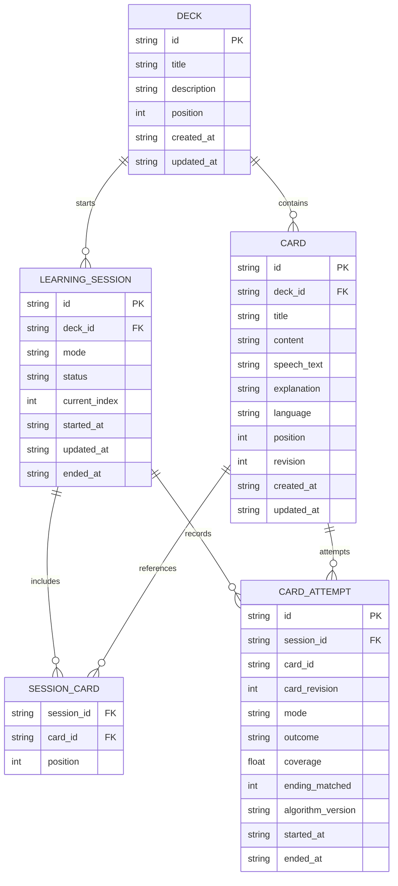

# 数据模型

状态：草稿
Schema 版本：1

## 1. 通用约定

- 所有 ID 使用 UUID 字符串。
- 所有时间使用 UTC ISO 8601 字符串。
- 例如：`2026-09-15T08:00:00.000Z`。
- 排序位置 `position` 从 0 开始。
- 布尔值在 SQLite 中使用 `0` 和 `1`。
- 可选值使用 `NULL`。
- 删除卡组时，同时删除卡片及其未完成会话。
- 第一版不保存用户录音和完整识别文字。

## 2. 数据关系



## 3. 领域类型

以下片段用于表达字段和可空性，是设计伪代码；Android 实现使用 Kotlin `data class`、`enum class` 和 Room Entity。

```ts
export type ID = string;
export type ISODateTime = string;

export type LearningMode = 'manual' | 'repeat';

export type SessionStatus =
  | 'active'
  | 'paused'
  | 'completed'
  | 'abandoned';

export type AttemptOutcome =
  | 'viewed'
  | 'read_completed'
  | 'skipped';

export interface Deck {
  id: ID;
  title: string;
  description: string | null;
  position: number;
  createdAt: ISODateTime;
  updatedAt: ISODateTime;
}

export interface Card {
  id: ID;
  deckId: ID;
  title: string;
  content: string;
  speechText: string | null;
  explanation: string | null;
  language: string;
  position: number;
  revision: number;
  createdAt: ISODateTime;
  updatedAt: ISODateTime;
}

export interface LearningSession {
  id: ID;
  deckId: ID;
  mode: LearningMode;
  status: SessionStatus;
  currentIndex: number;
  startedAt: ISODateTime;
  updatedAt: ISODateTime;
  endedAt: ISODateTime | null;
}

export interface SessionCard {
  sessionId: ID;
  cardId: ID;
  position: number;
}

export interface MatchResult {
  coverage: number;
  endingMatched: boolean;
  algorithmVersion: string;
}

export interface CardAttempt {
  id: ID;
  sessionId: ID;
  cardId: ID;
  cardRevision: number;
  mode: LearningMode;
  outcome: AttemptOutcome;
  matchResult: MatchResult | null;
  startedAt: ISODateTime;
  endedAt: ISODateTime;
}

export interface UserSettings {
  defaultMode: LearningMode;
  speechRate: number;
  autoAdvanceDelayMs: number;
  updatedAt: ISODateTime;
}
```

## 4. Deck 卡组

卡组用于组织知识卡片。

| 字段 | 规则 |
|---|---|
| `id` | UUID，不可修改 |
| `title` | 去除首尾空格后不能为空 |
| `description` | 可选说明 |
| `position` | 卡组列表中的顺序 |
| `createdAt` | 创建时间 |
| `updatedAt` | 最后修改时间 |

卡片数量通过查询计算，不在卡组表中重复保存。

## 5. Card 卡片

| 字段 | 规则 |
|---|---|
| `deckId` | 所属卡组 |
| `title` | 去除首尾空格后不能为空 |
| `content` | 展示正文，不能为空 |
| `speechText` | 实际朗读和跟读内容 |
| `explanation` | 可选补充解释 |
| `language` | 默认 `zh-CN` |
| `position` | 卡片在卡组中的顺序 |
| `revision` | 初始为 1，学习内容修改后加 1 |

跟读目标按下面的规则取得：

```ts
const targetText =
  card.speechText?.trim() || card.content.trim();
```

修改以下字段时，`revision` 加 1：

- `content`
- `speechText`
- `language`

只修改标题、解释或位置时，不增加 `revision`。

## 6. LearningSession 学习会话

一次开始学习产生一个会话。

| 字段 | 规则 |
|---|---|
| `deckId` | 本轮学习的卡组 |
| `mode` | `manual` 或 `repeat` |
| `status` | 会话当前状态 |
| `currentIndex` | 当前卡片在固定快照中的位置 |
| `endedAt` | 完成或放弃时填写 |

开始学习时，将当时的卡片顺序写入 `session_cards`。

这样即使用户在学习过程中调整卡片顺序，本轮学习顺序也不会突然改变。

会话结束时：

```text
currentIndex = session_cards 数量
status = completed
endedAt = 当前时间
```

## 7. CardAttempt 单卡学习记录

每处理一次卡片，创建一条记录。

| outcome | 含义 |
|---|---|
| `viewed` | 手动模式下看过并翻页 |
| `read_completed` | 自动模式下通过跟读判断 |
| `skipped` | 用户主动跳过 |

`matchResult` 规则：

- 手动查看：`null`
- 用户跳过：`null`
- 跟读完成：保存覆盖率、结尾匹配结果和算法版本

`coverage` 范围是 `0` 到 `1`，它表示文本覆盖程度，不代表发音分数或知识掌握程度。

`cardRevision` 保存学习时的卡片版本，便于区分修改前后的学习记录。

## 8. UserSettings 用户设置

第一版只保存一份本地设置。

默认值：

```ts
export const DEFAULT_SETTINGS: UserSettings = {
  defaultMode: 'manual',
  speechRate: 1,
  autoAdvanceDelayMs: 600,
  updatedAt: new Date().toISOString(),
};
```

约束：

- `speechRate`：`0.5` 到 `2.0`
- `autoAdvanceDelayMs`：`0` 到 `3000`
- 没有设置记录时使用默认值

## 9. SQLite 建表语句

```sql
PRAGMA foreign_keys = ON;

CREATE TABLE IF NOT EXISTS decks (
  id TEXT PRIMARY KEY NOT NULL,
  title TEXT NOT NULL CHECK (length(trim(title)) > 0),
  description TEXT,
  position INTEGER NOT NULL DEFAULT 0 CHECK (position >= 0),
  created_at TEXT NOT NULL,
  updated_at TEXT NOT NULL
);

CREATE TABLE IF NOT EXISTS cards (
  id TEXT PRIMARY KEY NOT NULL,
  deck_id TEXT NOT NULL,
  title TEXT NOT NULL CHECK (length(trim(title)) > 0),
  content TEXT NOT NULL CHECK (length(trim(content)) > 0),
  speech_text TEXT,
  explanation TEXT,
  language TEXT NOT NULL DEFAULT 'zh-CN',
  position INTEGER NOT NULL DEFAULT 0 CHECK (position >= 0),
  revision INTEGER NOT NULL DEFAULT 1 CHECK (revision >= 1),
  created_at TEXT NOT NULL,
  updated_at TEXT NOT NULL,

  FOREIGN KEY (deck_id)
    REFERENCES decks(id)
    ON DELETE CASCADE
);

CREATE TABLE IF NOT EXISTS learning_sessions (
  id TEXT PRIMARY KEY NOT NULL,
  deck_id TEXT NOT NULL,
  mode TEXT NOT NULL CHECK (mode IN ('manual', 'repeat')),
  status TEXT NOT NULL CHECK (
    status IN ('active', 'paused', 'completed', 'abandoned')
  ),
  current_index INTEGER NOT NULL DEFAULT 0 CHECK (current_index >= 0),
  started_at TEXT NOT NULL,
  updated_at TEXT NOT NULL,
  ended_at TEXT,

  FOREIGN KEY (deck_id)
    REFERENCES decks(id)
    ON DELETE CASCADE
);

CREATE TABLE IF NOT EXISTS session_cards (
  session_id TEXT NOT NULL,
  card_id TEXT NOT NULL,
  position INTEGER NOT NULL CHECK (position >= 0),

  PRIMARY KEY (session_id, position),

  FOREIGN KEY (session_id)
    REFERENCES learning_sessions(id)
    ON DELETE CASCADE,

  FOREIGN KEY (card_id)
    REFERENCES cards(id)
    ON DELETE CASCADE
);

CREATE TABLE IF NOT EXISTS card_attempts (
  id TEXT PRIMARY KEY NOT NULL,
  session_id TEXT NOT NULL,
  card_id TEXT NOT NULL,
  card_revision INTEGER NOT NULL CHECK (card_revision >= 1),
  mode TEXT NOT NULL CHECK (mode IN ('manual', 'repeat')),
  outcome TEXT NOT NULL CHECK (
    outcome IN ('viewed', 'read_completed', 'skipped')
  ),
  coverage REAL CHECK (
    coverage IS NULL OR
    (coverage >= 0 AND coverage <= 1)
  ),
  ending_matched INTEGER CHECK (
    ending_matched IS NULL OR
    ending_matched IN (0, 1)
  ),
  algorithm_version TEXT,
  started_at TEXT NOT NULL,
  ended_at TEXT NOT NULL,

  FOREIGN KEY (session_id)
    REFERENCES learning_sessions(id)
    ON DELETE CASCADE
);

CREATE TABLE IF NOT EXISTS user_settings (
  id INTEGER PRIMARY KEY NOT NULL CHECK (id = 1),
  default_mode TEXT NOT NULL CHECK (
    default_mode IN ('manual', 'repeat')
  ),
  speech_rate REAL NOT NULL DEFAULT 1.0 CHECK (
    speech_rate >= 0.5 AND speech_rate <= 2.0
  ),
  auto_advance_delay_ms INTEGER NOT NULL DEFAULT 600 CHECK (
    auto_advance_delay_ms >= 0 AND
    auto_advance_delay_ms <= 3000
  ),
  updated_at TEXT NOT NULL
);
```

`card_attempts.card_id` 不设置外键，这样删除卡片后，历史学习记录仍能保留卡片 ID。

## 10. 数据库索引

```sql
CREATE INDEX IF NOT EXISTS idx_decks_position
  ON decks(position);

CREATE INDEX IF NOT EXISTS idx_cards_deck_position
  ON cards(deck_id, position);

CREATE INDEX IF NOT EXISTS idx_sessions_deck_started
  ON learning_sessions(deck_id, started_at DESC);

CREATE INDEX IF NOT EXISTS idx_session_cards_card
  ON session_cards(card_id);

CREATE INDEX IF NOT EXISTS idx_attempts_session
  ON card_attempts(session_id);

CREATE INDEX IF NOT EXISTS idx_attempts_card_ended
  ON card_attempts(card_id, ended_at DESC);
```

## 11. 事务规则

以下操作必须放在同一个数据库事务中：

### 创建学习会话

1. 创建 `learning_sessions`。
2. 查询卡组中的卡片顺序。
3. 写入全部 `session_cards`。
4. 提交事务。

### 自动完成一张卡片

1. 创建 `card_attempts`。
2. 更新会话的 `current_index`。
3. 更新会话的 `updated_at`。
4. 如果是最后一张，将会话标记为 `completed`。
5. 提交事务。
6. 事务成功后才能在界面上自动翻页。

### 删除卡组

1. 用户确认删除。
2. 删除卡组。
3. 通过外键级联删除卡片和相关会话。
4. 提交事务。

## 12. 数据库版本

Room 数据库声明 Schema 版本，底层同步到 SQLite `user_version`：

```sql
PRAGMA user_version = 1;
```

以后每次修改表结构都新增 Room `Migration`，导出 schema JSON，并补充迁移测试；不能直接改写已经发布的迁移行为。

示例：

```text
app/schemas/
└── <database-class>/
    ├── 1.json
    └── 2.json

app/src/main/java/.../data/database/migration/
└── Migrations.kt
```
