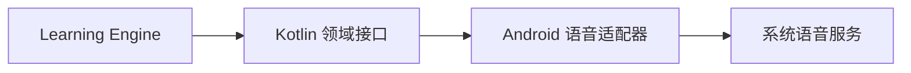
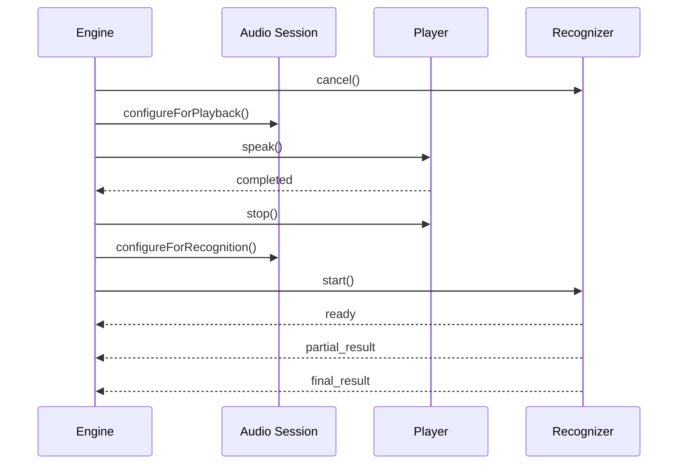

# 语音接口设计

状态：草稿  
接口版本：1

## 1. 目标

语音模块向 Learning Engine 提供统一能力：

- 将卡片文字朗读出来
- 通知朗读开始、完成或失败
- 识别用户跟读内容
- 返回临时和最终识别结果
- 检查设备能力和麦克风权限
- 处理停止、取消和系统音频中断

Android 系统服务的生命周期、权限和错误必须封装在语音模块内部。

本文中的接口片段用于表达契约，是设计伪代码；Android 实现使用 Kotlin 接口、`data class`、`sealed interface`、协程与 `Flow`。

## 2. 模块边界



Learning Engine 不直接调用 Android SDK API。

## 3. 文件结构

```text
app/src/main/java/.../
├── domain/speech/
│   ├── SpeechModels.kt
│   ├── SpeechPlayer.kt
│   ├── SpeechRecognizer.kt
│   └── SpeechCapabilityService.kt
└── speech/android/
    ├── AndroidSpeechPlayer.kt
    ├── AndroidSpeechRecognizer.kt
    ├── AndroidSpeechCapabilityService.kt
    ├── AudioFocusController.kt
    └── SpeechErrorMapper.kt
```

第一版由 Android 原生应用直接调用系统语音服务，不经过 JS 桥接或第三方跨平台封装。

## 4. 设备能力

```ts
export interface SpeechCapabilities {
  synthesisAvailable: boolean;
  recognitionAvailable: boolean;
  microphonePermission:
    | 'undetermined'
    | 'granted'
    | 'denied'
    | 'restricted';

  supportedRecognitionLanguages: string[];
  supportedSynthesisLanguages: string[];

  onDeviceRecognitionAvailable: boolean;
}
```

`onDeviceRecognitionAvailable` 表示当前设备存在端侧识别能力，不表示所有语言都可以离线识别。

提供能力检查接口：

```ts
export interface SpeechCapabilityService {
  getCapabilities(
    language?: string,
  ): Promise<SpeechCapabilities>;

  requestMicrophonePermission():
    Promise<SpeechCapabilities['microphonePermission']>;
}
```

只有用户进入自动跟读功能后，才请求麦克风权限。

## 5. 朗读接口

```ts
export interface SpeakRequest {
  operationId: string;
  text: string;
  language: string;
  rate: number;
}

export type SpeechPlayerEvent =
  | {
      type: 'started';
      operationId: string;
    }
  | {
      type: 'completed';
      operationId: string;
    }
  | {
      type: 'stopped';
      operationId: string;
    }
  | {
      type: 'error';
      operationId: string;
      error: SpeechError;
    };

export interface SpeechPlayer {
  speak(request: SpeakRequest): Promise<void>;

  stop(operationId?: string): Promise<void>;

  addListener(
    listener: (event: SpeechPlayerEvent) => void,
  ): () => void;

  dispose(): Promise<void>;
}
```

### 朗读规则

- `text` 去除首尾空格后不能为空。
- 开始新朗读前先停止上一条朗读。
- `speak()` 表示请求已被系统接受，不表示朗读完成。
- 只有收到 `completed` 事件才表示朗读完成。
- `stop()` 不能产生 `completed` 事件。
- 所有事件都必须携带原始 `operationId`。
- 同一个操作最多产生一次终止事件：`completed`、`stopped` 或 `error`。

## 6. 识别接口

```ts
export interface RecognitionRequest {
  operationId: string;
  language: string;
  partialResults: boolean;
  preferOnDevice: boolean;
}

export type SpeechRecognizerEvent =
  | {
      type: 'ready';
      operationId: string;
    }
  | {
      type: 'speech_started';
      operationId: string;
    }
  | {
      type: 'partial_result';
      operationId: string;
      transcript: string;
    }
  | {
      type: 'final_result';
      operationId: string;
      transcript: string;
    }
  | {
      type: 'speech_ended';
      operationId: string;
    }
  | {
      type: 'stopped';
      operationId: string;
    }
  | {
      type: 'error';
      operationId: string;
      error: SpeechError;
    };

export interface SpeechRecognizer {
  start(request: RecognitionRequest): Promise<void>;

  stop(operationId?: string): Promise<void>;

  cancel(operationId?: string): Promise<void>;

  addListener(
    listener: (event: SpeechRecognizerEvent) => void,
  ): () => void;

  dispose(): Promise<void>;
}
```

### `stop` 与 `cancel` 的区别

`stop()`：

- 停止继续收音
- 允许系统处理已经收到的音频
- 仍可能返回最终识别结果
- 适合用户自然读完后的结束处理

`cancel()`：

- 立即取消当前识别
- 丢弃尚未处理的结果
- 不能用后续结果更新当前学习状态
- 适合暂停、翻页、重读和退出页面

即使调用了 `cancel()`，Learning Engine 仍然必须通过 `operationId` 忽略迟到回调。

## 7. 错误格式

```ts
export type SpeechErrorCode =
  | 'PERMISSION_DENIED'
  | 'RECOGNITION_UNAVAILABLE'
  | 'SYNTHESIS_UNAVAILABLE'
  | 'LANGUAGE_UNSUPPORTED'
  | 'NO_SPEECH'
  | 'NETWORK_REQUIRED'
  | 'NETWORK_ERROR'
  | 'AUDIO_BUSY'
  | 'AUDIO_INTERRUPTED'
  | 'RECOGNITION_TIMEOUT'
  | 'CANCELLED'
  | 'INTERNAL_ERROR';

export interface SpeechError {
  code: SpeechErrorCode;
  message: string;
  nativeCode: string | null;
  recoverable: boolean;
}
```

原生平台错误必须先转换为统一错误码，再传给 Learning Engine。

页面不能直接展示 `nativeCode`。

## 8. 音频状态接口

```ts
export type AudioInterruptionEvent =
  | {
      type: 'interruption_started';
      reason: string | null;
    }
  | {
      type: 'interruption_ended';
      shouldResume: boolean;
    }
  | {
      type: 'route_changed';
      route: 'speaker' | 'receiver' | 'headphones' | 'bluetooth';
    };

export interface AudioFocusController {
  configureForPlayback(): Promise<void>;
  configureForRecognition(): Promise<void>;
  deactivate(): Promise<void>;

  addInterruptionListener(
    listener: (event: AudioInterruptionEvent) => void,
  ): () => void;
}
```

即使系统提示 `shouldResume: true`，App 也不自动开启麦克风。中断结束后保持暂停，等待用户点击继续。

## 9. 朗读与识别切换

自动跟读的音频流程：



不能在系统朗读期间开启语音识别，否则可能把 App 自己的声音当作用户跟读。

朗读结束后是否需要短暂等待，由真机测试决定，不在接口中写死。

## 10. Android 实现

Android 适配器使用 Kotlin 封装：

- `android.speech.tts.TextToSpeech`
- `android.speech.SpeechRecognizer`
- `RecognitionListener`
- 系统麦克风权限
- Audio Focus 和音频中断

需要处理：

- 初始化 TextToSpeech 后再调用朗读
- 使用 utterance ID 对应 `operationId`
- 将 `onDone` 转换成 `completed`
- 将 `onPartialResults` 转换成 `partial_result`
- 将 `onResults` 转换成 `final_result`
- 检查语音识别服务是否可用
- 在主线程调用要求运行在主线程的系统 API
- 页面退出后销毁识别器和朗读资源

不能假设所有 Android 手机都有相同的语音引擎、语言包或离线识别能力。

## 11. 权限流程

自动跟读入口的权限流程：

```text
用户打开自动跟读
        ↓
检查麦克风权限和语音识别服务
        ↓
尚未决定 → 显示用途说明 → 请求权限
        ↓
    ┌───┴────┐
  已允许     已拒绝
    ↓          ↓
开始跟读    显示设置入口
             保留手动模式
```

权限说明应表达：

> 知声卡需要使用麦克风识别你的跟读进度。第一版不会保存录音。

不能在 App 启动时无理由请求麦克风权限。

## 12. 隐私边界

第一版遵守以下规则：

- 不保存原始录音。
- 不保存完整识别文字。
- 只保存完成结果和覆盖率。
- 若系统识别需要联网，应在隐私说明中告知用户。
- 日志中不能记录用户完整跟读内容。
- 调试日志在正式构建中关闭或脱敏。
- 切换到后台后立即停止收音。

## 13. 模拟实现

为了在没有真机语音环境时开发页面，需要提供模拟实现：

```ts
export interface SpeechServices {
  player: SpeechPlayer;
  recognizer: SpeechRecognizer;
  capabilities: SpeechCapabilityService;
  audioFocus: AudioFocusController;
}
```

开发环境可以注入：

```ts
const mockSpeechServices: SpeechServices = {
  player: new MockSpeechPlayer(),
  recognizer: new MockSpeechRecognizer(),
  capabilities: new MockSpeechCapabilityService(),
  audioFocus: new MockAudioFocusController(),
};
```

模拟识别器应支持：

- 发送部分识别结果
- 发送最终识别结果
- 模拟无语音
- 模拟权限拒绝
- 模拟识别失败
- 模拟迟到回调
- 模拟重复完成回调

## 14. 第一版验收条件

- Android 语音实现遵守统一的 Kotlin 领域接口。
- App 朗读时不同时收音。
- 朗读完成事件可以正确关联到当前卡片。
- 部分识别结果能够实时返回。
- 暂停和翻页后，识别任务能够取消。
- 旧任务回调不能影响新卡片。
- 权限拒绝后仍可进入手动模式。
- App 进入后台后停止使用麦克风。
- 原生异常被转换为统一错误码。
- 语音模块释放后不再发送有效事件。
